<script src="https://cdn.jsdelivr.net/npm/mermaid/dist/mermaid.min.js"></script>
<script>
  mermaid.initialize({ startOnLoad: true, theme: 'default' });
</script>

# PandaDaw - Documentación Técnica Completa

**Versión:** 1.0  
**Fecha:** Febrero 2026  
**Equipo:** 3 Desarrolladores  
**Tarifa:** 25€/hora

---

## 1. Resumen Ejecutivo

PandaDaw es una plataforma de comercio electrónico completa desarrollada con tecnología .NET. El proyecto consiste en dos aplicaciones principales:

- **PandaBack**: API REST y servicios backend
- **PandaDawRazor**: Interfaz de usuario con Razor Pages y Blazor

### Características Principales

- 🛒 Carrito de compras persistente
- ❤️ Sistema de favoritos
- ⭐ Valoraciones y reseñas en tiempo real
- 👤 Sistema de autenticación y autorización
- 📦 Gestión de productos (Admin)
- 💳 Sistema de pedidos y pagos
- 🔔 Notificaciones en tiempo real
- 📱 Diseño responsivo con Tailwind CSS + DaisyUI

---

## 2. Arquitectura del Sistema

### 2.1 Diagrama de Arquitectura General

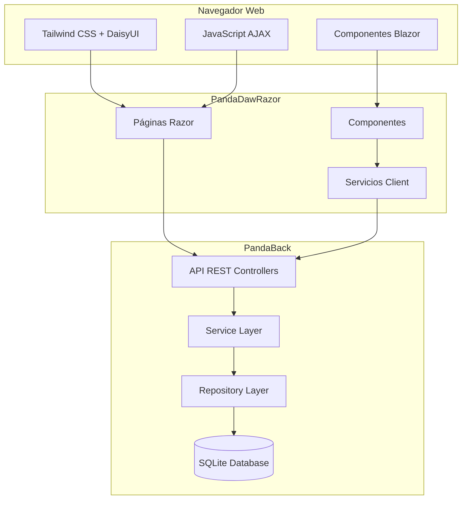

### 2.2 Patrón de Diseño

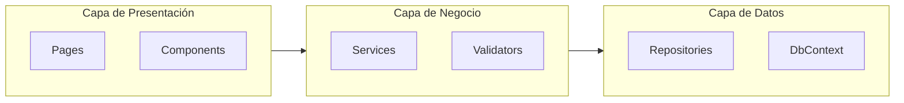

---

## 3. Estructura del Proyecto

### 3.1 Proyectos en la Solución

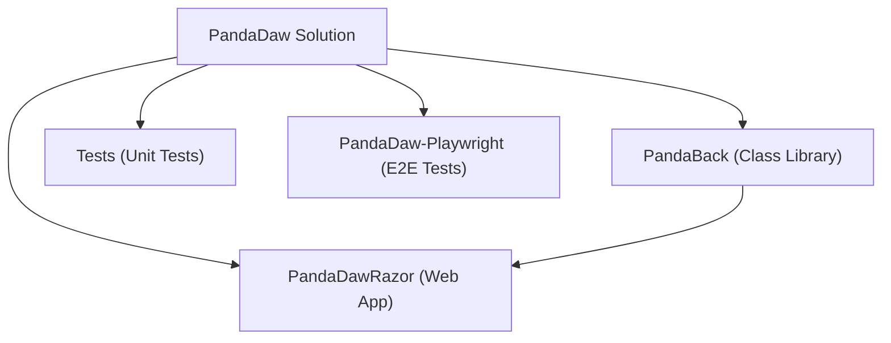

### 3.2 Estructura de Carpetas - PandaBack

```
PandaBack/
├── config/              # Configuraciones
│   ├── CacheConfig.cs
│   └── DotEnvLoader.cs
├── Data/               # Contexto de datos
│   ├── PandaDbContext.cs
│   └── DataSeeder.cs
├── Dtos/               # Objetos de Transferencia
│   ├── Auth/
│   ├── Carrito/
│   ├── Favoritos/
│   ├── Productos/
│   ├── Valoraciones/
│   └── Ventas/
├── Errors/             # Manejo de errores
│   └── PandaError.cs
├── Mappers/           # Mapeo de entidades
│   ├── CarritoMapper.cs
│   ├── FavoritoMapper.cs
│   ├── ProductoMapper.cs
│   ├── UserMapper.cs
│   ├── ValoracionMapper.cs
│   └── VentaMapper.cs
├── Middleware/        # Middleware personalizado
│   └── GlobalExceptionHandler.cs
├── Models/            # Entidades del dominio
│   ├── Carrito.cs
│   ├── Categoria.cs
│   ├── EstadoPedido.cs
│   ├── Favorito.cs
│   ├── LineaCarrito.cs
│   ├── LineaVenta.cs
│   ├── Producto.cs
│   ├── Role.cs
│   ├── User.cs
│   ├── Valoracion.cs
│   └── Venta.cs
├── Repositories/      # Capa de acceso a datos
│   ├── Auth/
│   ├── Carrito/
│   ├── Favoritos/
│   ├── Productos/
│   ├── Valoraciones/
│   └── Ventas/
├── RestController/    # Controladores REST API
│   ├── AuthController.cs
│   ├── CarritoController.cs
│   ├── FavoritosController.cs
│   ├── ProductosController.cs
│   ├── ValoracionesController.cs
│   └── VentasController.cs
├── Services/         # Capa de servicios
│   ├── Auth/
│   ├── Carrito/
│   ├── Email/
│   ├── Factura/
│   ├── Favoritos/
│   ├── Productos/
│   ├── Stripe/
│   ├── Valoraciones/
│   └── Ventas/
├── Validators/       # Validadores
│   ├── Carrito/
│   ├── Favoritos/
│   ├── Productos/
│   ├── Valoraciones/
│   └── Ventas/
└── Program.cs        # Punto de entrada
```

### 3.3 Estructura de Carpetas - PandaDawRazor

```
PandaDawRazor/
├── Components/           # Componentes Blazor
│   ├── ContadorCarrito.razor
│   ├── NotificacionesToast.razor
│   └── ValoracionesRealtime.razor
├── Filters/             # Filtros de páginas
│   └── NavBadgePageFilter.cs
├── Pages/               # Páginas Razor
│   ├── AdminPanel.cshtml
│   ├── Api.cshtml
│   ├── Carrito.cshtml
│   ├── Detalle.cshtml
│   ├── Favoritos.cshtml
│   ├── Index.cshtml
│   ├── Login.cshtml
│   ├── Pago.cshtml
│   ├── PagoExitoso.cshtml
│   ├── Pedidos.cshtml
│   ├── Register.cshtml
│   └── Shared/
├── Services/            # Servicios cliente
│   └── NotificacionService.cs
├── wwwroot/             # Archivos estáticos
│   ├── css/
│   ├── js/
│   └── lib/
└── Program.cs
```

---

## 4. Modelo de Datos

### 4.1 Diagrama de Entidades

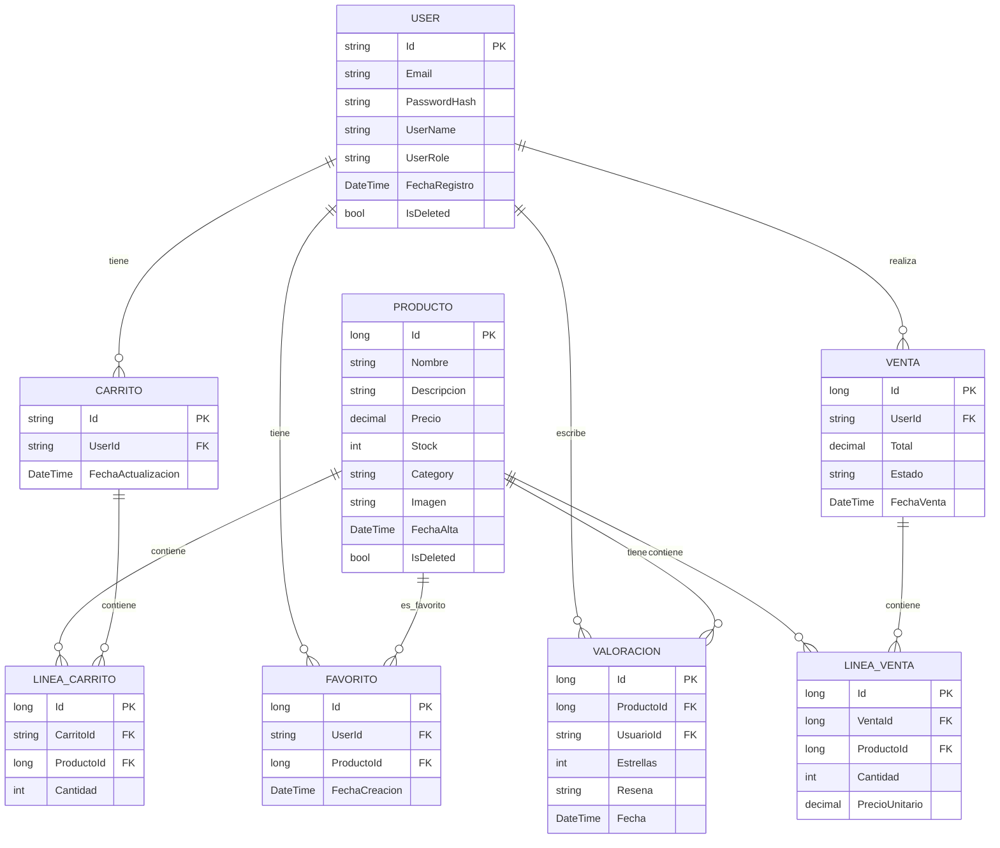

### 4.2 Enumeraciones

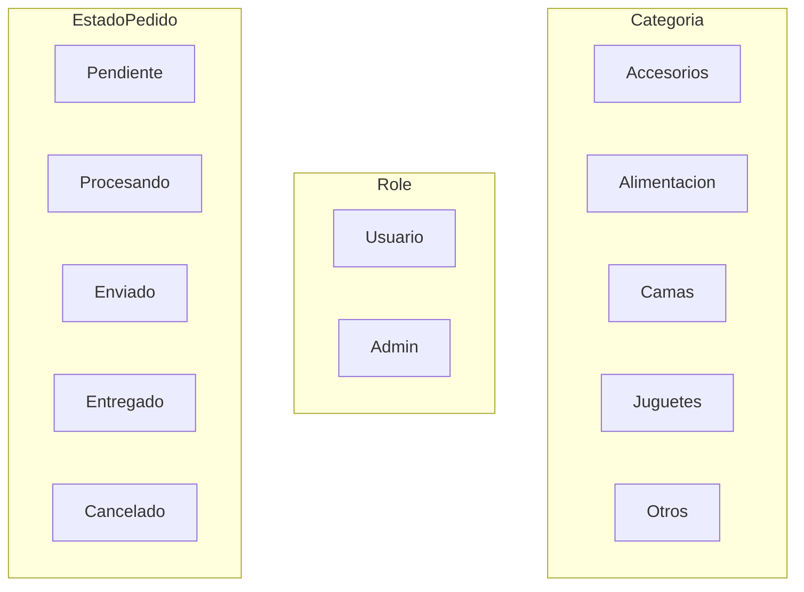

---

## 5. Servicios y API

### 5.1 Servicios Backend

```mermaid
classDiagram
    class IProductoService {
        <<interface>>
        +GetAllProductosAsync()
        +GetProductoByIdAsync(id)
        +GetProductosByCategoryAsync(category)
        +CreateProductoAsync(producto)
        +UpdateProductoAsync(id, producto)
        +DeleteProductoAsync(id)
    }

    class ICarritoService {
        <<interface>>
        +GetCarritoByUserIdAsync(userId)
        +AddLineaCarritoAsync(userId, productoId, cantidad)
        +UpdateLineaCantidadAsync(userId, productoId, cantidad)
        +RemoveLineaCarritoAsync(userId, productoId)
        +VaciarCarritoAsync(userId)
    }

    class IFavoritoService {
        <<interface>>
        +GetUserFavoritosAsync(userId)
        +AddToFavoritosAsync(userId, dto)
        +RemoveFromFavoritosAsync(id, userId)
    }

    class IValoracionService {
        <<interface>>
        +GetValoracionesByProductoAsync(productoId)
        +GetValoracionesByUserAsync(userId)
        +CreateValoracionAsync(userId, dto)
        +UpdateValoracionAsync(id, userId, dto)
        +DeleteValoracionAsync(id, userId)
    }

    class IVentaService {
        <<interface>>
        +GetVentasByUserAsync(userId)
        +GetVentaByIdAsync(id)
        +CreateVentaAsync(userId, dto)
        +UpdateEstadoAsync(id, estado)
    }

    class IAuthService {
        <<interface>>
        +LoginAsync(dto)
        +RegisterAsync(dto)
        +ValidateTokenAsync(token)
    }
```

### 5.2 Endpoints REST API

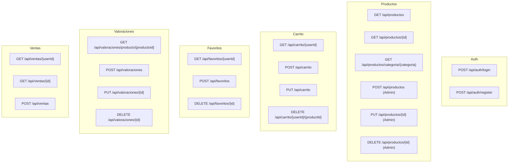

---

## 6. Interfaces de Usuario

### 6.1 Mapa de Páginas

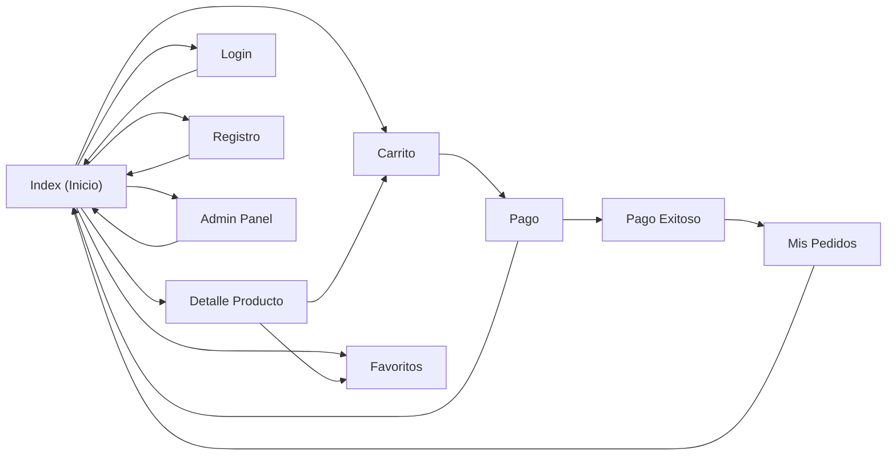

### 6.2 Componentes Blazor

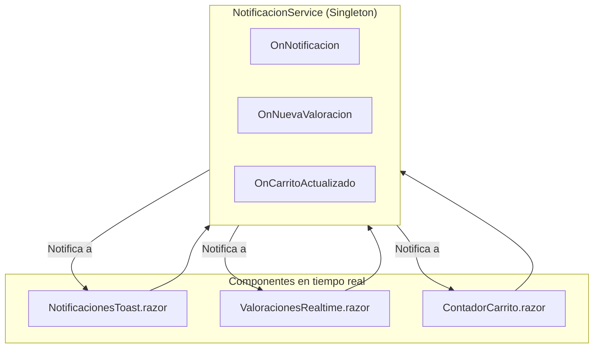

---

## 7. Flujos de Usuario

### 7.1 Flujo de Compra

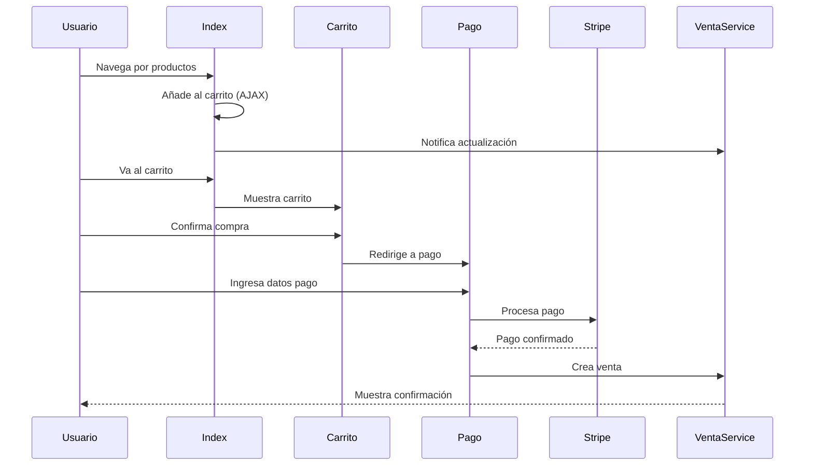

### 7.2 Flujo de Valoración

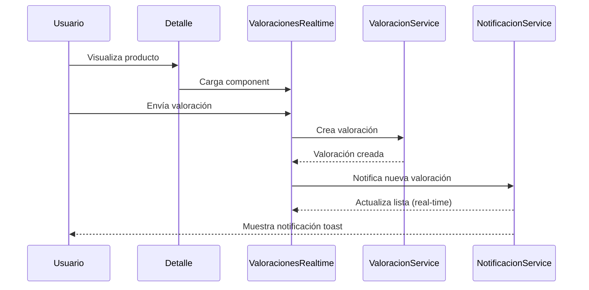

---

## 8. Tecnologías Utilizadas

### 8.1 Stack Tecnológico

| Capa          | Tecnología               | Versión |
| ------------- | ------------------------ | ------- |
| Runtime       | .NET                     | 10.0    |
| Frontend      | ASP.NET Core Razor Pages | 10.0    |
| Componentes   | Blazor Server            | 10.0    |
| CSS           | Tailwind CSS             | 3.x     |PP
| UI Framework  | DaisyUI                  | 4.x     |
| Base de Datos | SQLite                   | -       |
| ORM           | Entity Framework Core    | 10.0    |
| Testing       | xUnit                    | -       |
| E2E Testing   | Playwright               | -       |
| Icons         | Font Awesome             | 6.x     |

### 8.2 Paquetes NuGet Principales

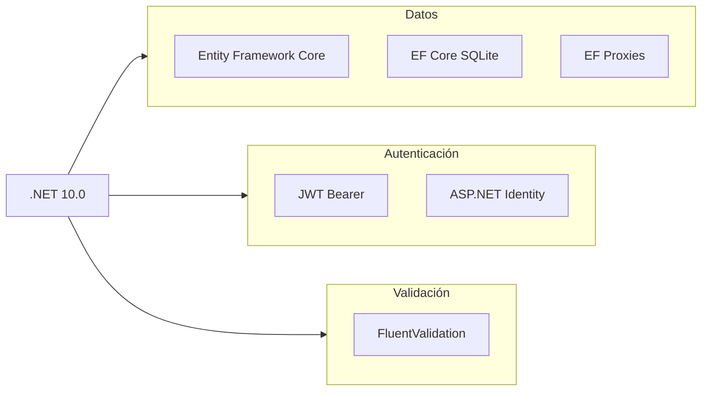

---

## 9. Presupuesto

### 9.1 Estimación de Horas por Fase

| Fase                           | Descripción                              | Horas    | Coste (3 devs) |
| ------------------------------ | ---------------------------------------- | -------- | -------------- |
| **Fase 1: Setup**              | Configuración proyecto, estructura base  | 40h      | 3.000€         |
| **Fase 2: Modelos**            | Entidades, DTOs, Mapeadores              | 60h      | 4.500€         |
| **Fase 3: Repositorios**       | Acceso a datos, CRUD                     | 80h      | 6.000€         |
| **Fase 4: Servicios**          | Lógica de negocio                        | 100h     | 7.500€         |
| **Fase 5: API REST**           | Controladores endpoints                  | 40h      | 3.000€         |
| **Fase 6: Frontend Pages**     | Páginas Razor principales                | 120h     | 9.000€         |
| **Fase 7: Componentes Blazor** | Notificaciones, valoraciones tiempo real | 60h      | 4.500€         |
| **Fase 8: UI/UX**              | Estilos, animaciones, responsive         | 80h      | 6.000€         |
| **Fase 9: Testing**            | Unit tests, integración                  | 60h      | 4.500€         |
| **Fase 10: Documentación**     | README, comentarios, guías               | 40h      | 3.000€         |
| **Fase 11: Ajustes**           | Bug fixes, mejoras                       | 80h      | 6.000€         |
|                                | **TOTAL**                                | **760h** | **57.000€**    |

### 9.2 Costes Adicionales

| Concepto                 | Coste Estimado          |
| ------------------------ | ----------------------- |
| Dominio (anual)          | 15€                     |
| Hosting (VPS/Cloud)      | 50€/mes × 12 = 600€/año |
| SSL (Let's Encrypt)      | Gratis                  |
| Base de datos gestionada | 0€ (SQLite local)       |
| **Total Year 1**         | **615€**                |

### 9.3 Resumen Budget

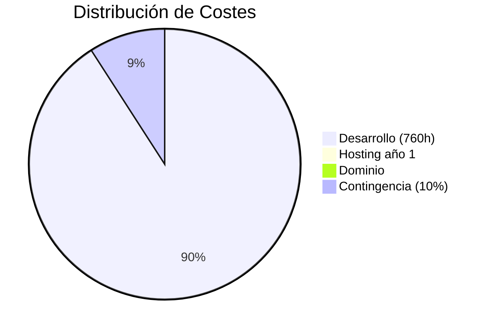

| Concepto                   | Importe     |
| -------------------------- | ----------- |
| **Desarrollo**             | 57.000€     |
| **Infraestructura Year 1** | 615€        |
| **Contingencia (10%)**     | 5.700€      |
| **TOTAL PROYECTO**         | **63.315€** |

### 9.4 Coste por Desarrollador

| Métrica                 | Valor   |
| ----------------------- | ------- |
| Horas totales           | 760h    |
| Horas por desarrollador | ~253h   |
| Coste por desarrollador | 19.000€ |

---

## 10. Mejores Prácticas Implementadas

### 10.1 Patrones de Diseño

- ✅ **Repository Pattern**: Abstracción del acceso a datos
- ✅ **Service Layer**: Lógica de negocio encapsulada
- ✅ **DTOs**: Transferencia de datos controlada
- ✅ **Dependency Injection**: Inyección de dependencias nativa
- ✅ **Singleton Pattern**: NotificacionService

### 10.2 Seguridad

- ✅ **JWT Authentication**: Tokens para API
- ✅ **Password Hashing**: BCrypt para contraseñas
- ✅ **Role-based Authorization**: Admin vs Usuario
- ✅ **Input Validation**: FluentValidation
- ✅ **SQL Injection Protection**: Entity Framework

### 10.3 Rendimiento

- ✅ **Async/Await**: Operaciones asíncronas
- ✅ **Entity Proxies**: Lazy loading
- ✅ **AJAX**: Actualizaciones sin recarga
- ✅ **Blazor SignalR**: Tiempo real eficiente

---

## 11. Glosario

| Término              | Definición                                                      |
| -------------------- | --------------------------------------------------------------- |
| **DTO**              | Data Transfer Object - Objeto para transferir datos entre capas |
| **Repository**       | Patrón para abstraer el acceso a datos                          |
| **Service**          | Clase que encapsula lógica de negocio                           |
| **Blazor**           | Framework .NET para crear interfaces web                        |
| **Razor Pages**      | Modelo de desarrollo web basado en páginas                      |
| **SignalR**          | Biblioteca para comunicación en tiempo real                     |
| **JWT**              | JSON Web Token - Estándar para autenticación                    |
| **FluentValidation** | Biblioteca para validaciones fluent                             |

---

## 12. Anexos

### A. Comandos Útiles

```bash
# Restaurar paquetes
dotnet restore

# Compilar proyecto
dotnet build

# Ejecutar tests
dotnet test

# Ejecutar aplicación
dotnet run --project PandaDawRazor

# Añadir migración
dotnet ef migrations add InitialCreate

# Actualizar base de datos
dotnet ef database update
```

### B. Variables de Entorno

```
DB_CONNECTION_STRING=Data Source=panda.db
JWT_SECRET=tu_secreto_aqui
JWT_EXPIRY_HOURS=24
```

---

**Documento generado automáticamente para PandaDaw**  
_Febrero 2026_
